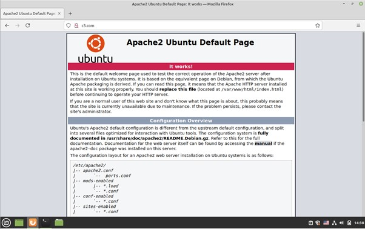
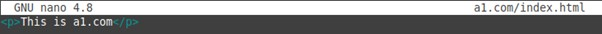
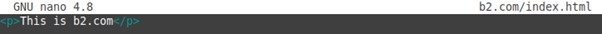

# Установка и запуск веб-сервера в Linux
## Цель работы
### Освоить основные навыки установки и первоначальной настройки веб-сервера в ОС Linux.
## Задания для выполнения
1.Используя apt-get установить Apache2 на виртуальную машину

2.С браузера хост-машины по IP-адресу виртуальной машины увидеть приветствие

3.В настройках сервера изменить  порт на :8080

4.Снова выполнить п 2, но с указанием порта

5.Изменить порт обратно и проверить как работает заглушка

6.В hosts хост-машины создать три домена: a1.com, b2.com, c3.com и связываем с IP виртуальной машины с Apache

7.Для каждого домена проверить всё ли правильно, с помощью ping

8.Зайти на все три домена, написав их вместо IP виртуальной машины

9.Создать директории /var/www/a1.com, /var/www/b2.com, /var/www/c3.com

10.В каждой из них создать пустой index.html

11.В каждом из них написать различное содержимое

12.Сделать так, чтобы из браузеров хост-машины открывались сайты из директории, а не общая заглушка

